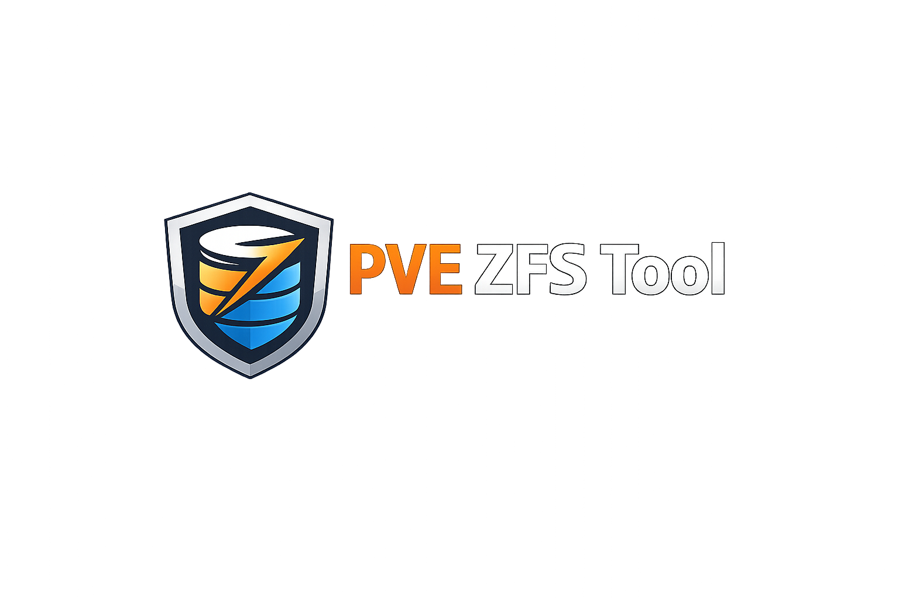

<p align="center">
  
</p>

<p align="center">A Docker-based web application for managing ZFS pools, datasets, snapshots, and auto-snapshots across one or more Proxmox VE hosts via SSH.</p>

## Features

### ZFS Pool Management
- **Pool Overview** -- Status, IO statistics, health, fragmentation, dedup ratio
- **Pool Scrub** -- Start scrubs directly from the UI
- **Pool Upgrade** -- Automatically detects if a feature upgrade is available (green button), with confirmation before upgrading
- **Pool History** -- View recent pool activity

### Dataset Management
- **List & Filter** -- View all datasets with type, compression, used/available space
- **Create Datasets** -- Create new datasets with optional compression settings
- **Properties** -- View and modify all ZFS dataset properties

### Snapshot Management
- **Interactive Timeline** -- Visual timeline grouped by dataset, newest first, with color-coded dots (blue = newest, auto vs. manual distinction)
- **Table View** -- Classic table view (default) with type badges (zvol/filesystem), switchable via dropdown
- **Search** -- Filter snapshots by dataset name in both timeline and table view
- **Create Snapshots** -- Manual snapshots with custom names, recursive support
- **Rollback** -- Smart rollback that auto-detects VMs/LXC containers, stops them before rollback and restarts them afterwards
- **Clone** -- Clone snapshots via modal dialog with target datastore/pool selector, editable clone name (default: `{name}_CLONE`), supports cross-pool cloning via `zfs send | zfs recv`
- **Diff** -- View changes for filesystem datasets (`zfs diff`) and zvol/VM snapshots (incremental send estimates, snapshot properties, size overview)
- **Delete** -- Remove manually created snapshots only (auto-snapshots are protected from deletion)

### Proxmox VM/CT Integration
- **Guest Overview** -- List all VMs and LXC containers with status
- **Per-Guest Snapshots** -- View ZFS snapshots specific to a VM or container
- **Smart Rollback** -- Automatically stops VM/LXC before rollback and restarts afterwards
- **File-Level Restore** -- Browse and restore individual files from LXC container snapshots:
  - Mounts snapshot as readonly clone
  - Navigate files via breadcrumb file browser
  - Preview text files directly in the UI
  - Restore individual files or entire directories back to the live container
  - Automatic cleanup: restore clone is unmounted when closing the browser (via X, backdrop click, or close button)

### Health & Monitoring
- **ARC Statistics** -- Adaptive Replacement Cache hit/miss rates and memory usage
- **ZFS Events** -- Recent ZFS kernel events
- **SMART Status** -- Disk health for all drives in each pool
- **Restore Clone Cleanup** -- View and destroy leftover restore-mount datasets with one-click cleanup

### Notifications
- **Telegram** -- Receive notifications via Telegram bot
- **Gotify** -- Receive notifications via self-hosted Gotify server
- **Test Notifications** -- Send test messages to verify configuration
- **Configurable Events** -- Enable/disable notifications per event type:
  - Scrub started/finished
  - Snapshot created/deleted
  - Rollback performed
  - Pool errors/degraded state
  - Pool upgraded
  - Health warnings
  - Host offline
  - File restore actions

### Multi-Host SSH
- **SSH Key Auto-Generation** -- Ed25519 key pair generated on first start
- **Public Key Display** -- Shown on the home page with copy button (works on HTTP and HTTPS)
- **Multiple Hosts** -- Add and manage multiple Proxmox VE nodes
- **Connection Test** -- Verify SSH connectivity per host

## Quick Start

```bash
# Clone the repository
git clone https://github.com/onlinecrash24/pve-zfs-tool.git
cd pve-zfs-tool

# Start the container
docker compose up -d --build

# Open the web UI
http://DOCKER-HOST-IP:5000
```

## Setup

1. **Start the container** -- The SSH key pair is generated automatically on first start.
2. **Copy the public key** -- The public key is displayed on the home page. Copy it.
3. **Add to Proxmox hosts** -- Paste the key into `~/.ssh/authorized_keys` on each Proxmox host:
   ```bash
   echo "ssh-ed25519 AAAA... zfs-tool@docker" >> /root/.ssh/authorized_keys
   ```
4. **Add hosts in the UI** -- Go to "Hosts", add name, IP, port, and user.
5. **Test connection** -- Click "Test" to verify SSH connectivity.
6. **Manage ZFS** -- Select a host from the dropdown and explore pools, snapshots, etc.

## Notifications Setup

### Telegram
1. Create a bot via [@BotFather](https://t.me/BotFather) on Telegram
2. Get your Chat ID via [@userinfobot](https://t.me/userinfobot) or [@getidsbot](https://t.me/getidsbot)
3. For group notifications, add the bot to the group and use the group Chat ID (starts with `-100`)
4. Enter Bot Token and Chat ID in the Notifications settings
5. Click "Send Test" to verify

### Gotify
1. Set up a [Gotify](https://gotify.net/) server
2. Create an application in Gotify and copy the app token
3. Enter the server URL and token in the Notifications settings
4. Click "Send Test" to verify

## Configuration

Environment variables in `docker-compose.yml`:

| Variable | Default | Description |
|----------|---------|-------------|
| `SECRET_KEY` | `change-me-in-production` | Flask session secret key |

Persistent volumes:

| Volume | Path | Description |
|--------|------|-------------|
| `ssh-keys` | `/root/.ssh` | SSH key pair (persisted across restarts) |
| `zfs-data` | `/app/data` | Host config, notification settings |

## Tech Stack

- **Backend** -- Python 3.12, Flask, Paramiko (SSH), Gunicorn
- **Frontend** -- Vanilla JavaScript SPA, CSS dark theme
- **Deployment** -- Docker, Docker Compose

## Project Structure

```
zfs-tool/
├── Dockerfile
├── docker-compose.yml
├── entrypoint.sh
├── requirements.txt
└── app/
    ├── main.py              # Flask API routes
    ├── ssh_manager.py       # SSH connection & host management
    ├── zfs_commands.py      # ZFS command wrappers via SSH
    ├── notifications.py     # Telegram & Gotify notifications
    ├── templates/
    │   └── index.html       # Single-page application
    └── static/
        ├── css/style.css    # Dark theme UI
        └── js/app.js        # Frontend logic
```

## License

MIT
